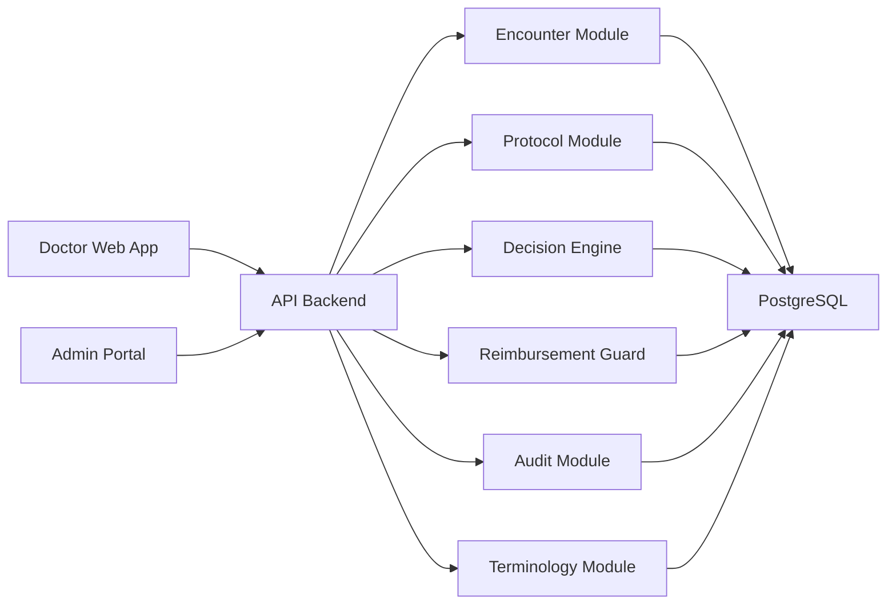

# System Architecture

## Proposed Architecture Style

Start with a **modular monolith** for faster delivery and easier domain alignment. Keep boundaries clean so services can be extracted later if scale or integration needs grow.

## High-Level Components

## Application Surfaces

### apps/web

Doctor-facing workflow for patient encounter, diagnosis entry, order review, alerts, and overrides.

### apps/admin

Admin-facing workflow for catalogs, protocol versions, mapping tables, reimbursement rules, and analytics.

### apps/api

Core backend that exposes REST or RPC endpoints for encounters, recommendations, rule evaluation, admin operations, and audit queries.

## Backend Module Boundaries

- auth
- users-and-roles
- patients-and-encounters
- diagnosis-and-context
- terminology-catalogs
- protocols
- medications
- cls-and-tests
- decision-engine
- reimbursement-guard
- audit-and-override
- reporting

## Decision Pipeline

1. Receive encounter context, ICD codes, and current draft orders.
2. Match applicable protocol versions.
3. Generate recommended CLS and medication options.
4. Evaluate cost composition and denial-risk rules.
5. Score alerts by severity and explainability.
6. Return a recommendation package with rationale and action hints.
7. Persist the run for audit and analytics.

## Integration Strategy

Phase 1 should support manual or file-assisted master data import.

Pilot data-source direction:

- Google Sheets for knowledge authoring and controlled import
- PostgreSQL for operational runtime storage
- API import jobs as the only allowed bridge between the two

Later integrations may include:

- HIS or EMR encounter feed
- LIS or RIS order/result sync
- pharmacy formulary sync
- BHYT claim export or review feed

## Non-Functional Requirements

- strong auditability
- deterministic rule execution
- versioned master data and rules
- role-based access control
- encrypted data at rest and in transit
- clear override accountability
- observable alert and failure tracking
