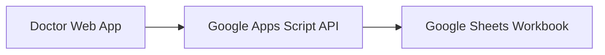

# Google Apps Script Pilot

## Goal

Run the pilot without a dedicated database server by using:

- Google Sheets as the temporary data store
- Google Apps Script as the lightweight API layer
- the web app as the doctor-facing client

## Recommended Architecture

## Runtime Rules

- the web app should call Apps Script, not Google Sheets directly
- credentials must stay in Apps Script, not in the browser
- workbook structure should follow the import template already documented
- this mode is for pilot speed, not final production architecture

## Expected Endpoints

- `GET ?action=template`
- `GET ?action=workbook-inspect`
- `GET ?action=pilot-context`
- `POST action=recommendations-preview`

Current recommendation behavior:

- map selected ICD codes to CLS suggestions from `mapping_icd_cls`
- map selected ICD codes to medication suggestions from `mapping_icd_medication`
- enrich item names from catalog tabs
- fall back to `protocol_item` if no mapping is found

## Deployment Steps

1. Create the Google Sheet workbook using the documented tabs and columns.
2. Create a Google Apps Script project bound to that workbook or linked by id.
3. Paste the provided `Code.gs`.
4. Set the workbook id in script properties or inline config.
5. Deploy as a web app with access appropriate for your pilot.
6. Set `NEXT_PUBLIC_RECOMMENDATION_API_URL` in the web app environment.

## Tradeoffs

Pros:

- no separate server to manage
- fast iteration with clinical teams
- easy editing of rule and protocol data

Constraints:

- weaker audit and access control than a full backend
- limited throughput and execution time
- not ideal for long-term operational scaling
